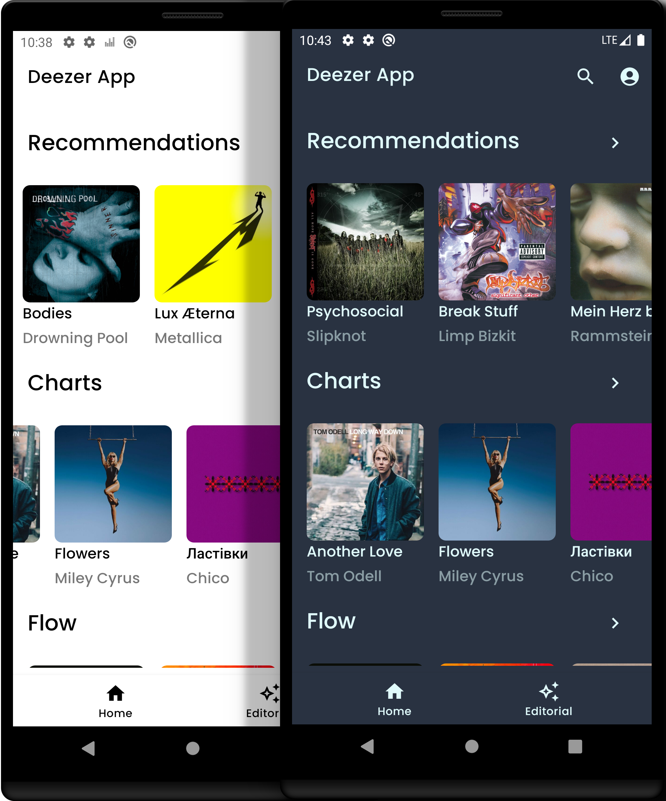
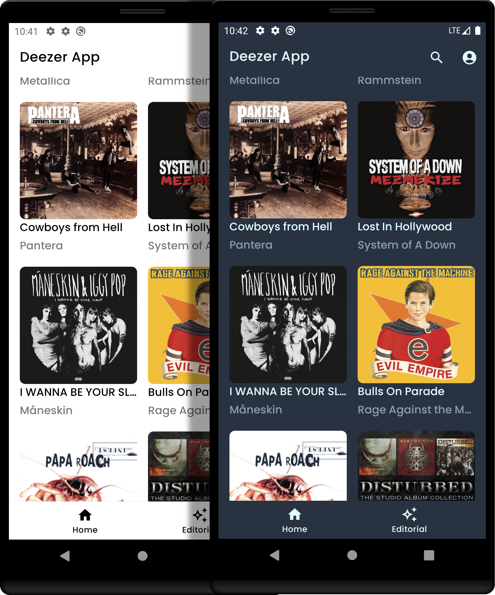

# Deezer for Android

## Overview

Deezer for Android is an application for streaming samples of music from Deezer streaming service.
With this app, you can easily search for tracks. listen to music samples. The app is written in
Kotlin
with the usage of different technologies (Room, Retrofit 2, Dagger 2, Android Jetpack, RxJava,
Kotlin Coroutines/Flow, etc.).

Deezer fo Android uses the official [Deezer API](https://developers.deezer.com/api) for retrieving
track samples, their info and additionally user-specific data.




## Features

The following features are currently available in the app:

1. Search for tracks.
2. Storing search history.
3. User authentication that allows retrieving user-specific sets of tracks.
4. Listen to music samples (30 sec due to API restrictions) in fore- and background.
5. Get notifications about any updates of the "Editorial" section.
6. Get notifications via FCM from the server about suggested media content.

## Build

To build the app you need to clone this git repository to your local machine first.
Then create two additional files in the root of your local repository: `keystore.properties`
and `remote_api_data.properties`.
The content of these files is as follows:

__keystore.properties__

```properties
storePassword=**KEYSTORE_PASSWORD**
keyPassword=**KEY_PASSWORD**
keyAlias=**KEY_ALIAS**
storeFile=**PATH_TO_JKS_KEYSTORE_FILE**
```

Replace star notations with your actual values. If you don't want to sign the app then don't create
this file and modify Gradle `build.config` file in `app` module.

__remote_api_data.properties__

```properties
access_token=**APP_ACCESS_TOKEN**
redirect_uri="**APP_REDIRECT_URI**"
```

Replace star notations with your actual values. To get an access token and a redirect URI for your
app
please follow the official [Deezer API](https://developers.deezer.com/api) reference.

Also you will need to connect to FCM. Generate `google-services.json` file either via Firebase
Console or Android Studio.